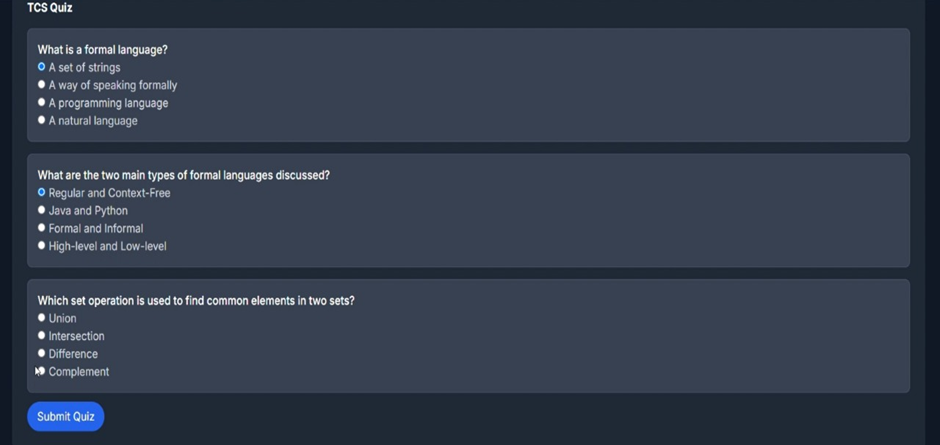

# Personalized AI Study Planner

This project is a comprehensive educational tool designed to help students efficiently manage their academic journey. Traditional study planners are often static and fail to adapt to individual learning styles, leading to ineffective time management and stress. This application solves that problem by using AI to generate dynamic, personalized study schedules, provide interactive learning tools, and offer real-time support, creating a structured and adaptive learning experience.

---

## ✨ Key Features

* **👤 Secure Authentication & Academic Profiling**: A secure sign-up and login system for users. New users can set up a detailed academic profile, specifying their university, domain, branch, and year to ensure a tailored experience.
* **🤖 AI-Driven Dynamic Timetables**: Generates personalized study schedules based on the user's subjects, learning pace, style, and priorities.
* **📚 Customized Plans with Resources**: The generated study plan outlines key topics for each day and provides a curated list of recommended resources, including PDFs and videos.
* **🧠 Adaptive Learning with Quizzes**: Includes an interactive quiz section to assess progress. The system generates "micro-learning pods" and quizzes to reinforce concepts.
* **📈 Progress Dashboard & Instant Results**: A central dashboard provides an at-a-glance view of quiz scores and study session completions. Users receive instant results and feedback after completing a quiz.
* **💬 AI Chat Assistant**: An integrated, AI-powered chatbot provides instant doubt clarification, personalized recommendations, and real-time support 24/7.
* **📅 Google Calendar Integration**: Seamlessly syncs the generated study schedule with the user's Google Calendar for reminders and better time management.

---

## 📸 Application Showcase

This section showcases the user journey through the application, from landing to getting AI-powered help.

**1. Landing Page** 


**2. Login Page** 


**3. Academic Profile Setup** 


**4. Main Dashboard** 


**5. Generating a Study Plan**


**6. Customized Study Plan View**


**7. Schedule with Provided Resources** 


**8. Google Calendar Integration**


**9. Generating Learning Pods and Quizzes** 


**10. Viewing Generated Quizzes**


**11. Taking a Quiz**



**12. Quiz Results**


**13. AI Chatbot** 


---

## 🛠️ Technology Stack

* **Backend**: Java 17 (Spring Boot)
* **AI Service**: Python (FastAPI) with Google Gemini API
* **Database**: MySQL
* **Frontend**: HTML, CSS (Tailwind CSS), JavaScript
* **APIs**: Google Calendar API
* **Authentication**: OAuth2 with Google
* **Build Tool**: Maven

---

## 🚀 Getting Started

### Prerequisites

* Java 17 or higher
* Python 3.8+
* MySQL 8.0+
* Node.js & npm
* A Google Cloud Platform account with the **Calendar API** enabled
* A **Gemini API key** from Google AI Studio

### Installation & Setup

#### 1. Backend (Spring Boot)
1.  **Clone the repository:**
    ```bash
    git clone <repository-url>
    cd <project-directory>
    ```
2.  **Configure the database:**
    * Create a MySQL database named `study_planner`.
    * Update your database credentials in `src/main/resources/application.properties`.
3.  **Configure Google OAuth2:**
    * Go to the [Google Cloud Console](https://console.cloud.google.com/).
    * Create a new project, enable the **Google Calendar API**.
    * Configure the OAuth consent screen.
    * Create an **OAuth 2.0 Client ID** and add the following authorized redirect URIs:
        * `http://localhost:8080/login/oauth2/code/google`

#### 2. AI Service (Python FastAPI)
1.  **Navigate to the AI service directory:**
    ```bash
    cd AI_services
    ```
2.  **Create and activate a virtual environment:**
    ```bash
    # For macOS/Linux
    python3 -m venv venv
    source venv/bin/activate

    # For Windows
    python -m venv venv
    venv\Scripts\activate
    ```
3.  **Install dependencies:**
    ```bash
    pip install fastapi uvicorn google-generativeai python-dotenv
    ```

#### 3. Frontend
1.  **Navigate to the static resources directory and install dependencies:**
    ```bash
    cd src/main/resources/static
    npm install
    ```

#### 4. Environment Variables
Create a `.env` file in the root directory and add the following variables:

SPRING_DATASOURCE_URL=jdbc:mysql://localhost:3306/study_planner
SPRING_DATASOURCE_USERNAME=your_db_username
SPRING_DATASOURCE_PASSWORD=your_db_password
GOOGLE_CLIENT_ID=your_google_client_id
GOOGLE_CLIENT_SECRET=your_google_client_secret
GEMINI_API_KEY=your_gemini_api_key

### Running the Application

1.  **Start the AI Service (from the `AI_services` directory):**
    ```bash
    uvicorn ai_api:app --reload --port 8000
    ```
2.  **Start the Spring Boot Application (from the project root directory):**
    ```bash
    ./mvnw spring-boot:run
    ```
3.  **Access the Application:**
    * **Website**: `http://localhost:8080`
    * **AI Service Docs**: `http://localhost:8000/docs`

<details>
<summary><strong>Click to view Backend Configuration (application.properties)</strong></summary>

```properties
# Server Configuration
server.port=8080

# Database Configuration
spring.datasource.url=${SPRING_DATASOURCE_URL}
spring.datasource.username=${SPRING_DATASOURCE_USERNAME}
spring.datasource.password=${SPRING_DATASOURCE_PASSWORD}
spring.jpa.hibernate.ddl-auto=update

# Google OAuth2 Configuration
spring.security.oauth2.client.registration.google.client-id=${GOOGLE_CLIENT_ID}
spring.security.oauth2.client.registration.google.client-secret=${GOOGLE_CLIENT_SECRET}
spring.security.oauth2.client.registration.google.scope=email,profile,[https://www.googleapis.com/auth/calendar](https://www.googleapis.com/auth/calendar)

# CORS Configuration
cors.allowed-origins=http://localhost:3000,http://localhost:8080

🤝 Contributing

1.Fork the repository
2.Create your feature branch (git checkout -b feature/AmazingFeature)
3.Commit your changes (git commit -m 'Add some AmazingFeature')
4.Push to the branch (git push origin feature/AmazingFeature)
5.Open a Pull Request
